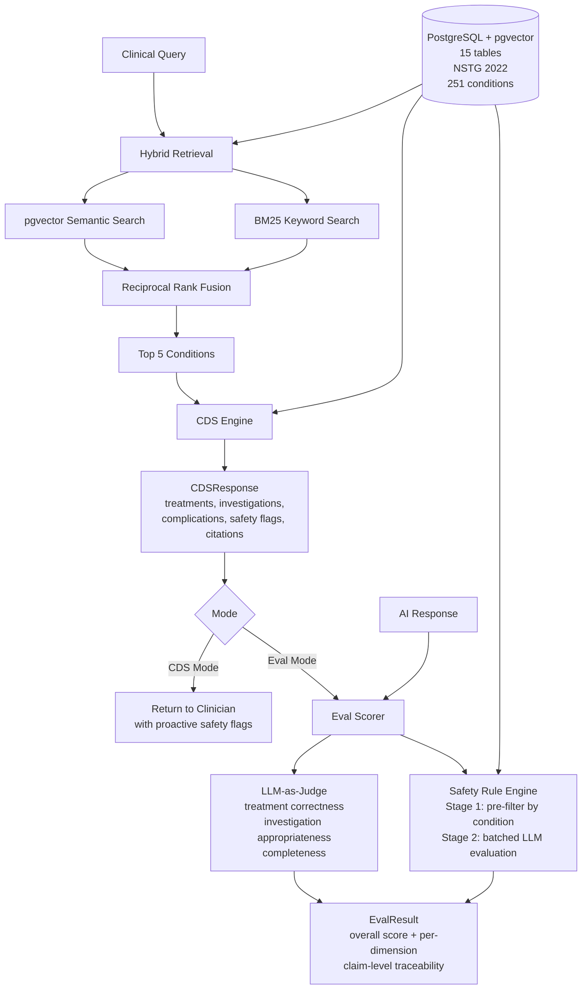

# ClinicalGuard

An open-source clinical AI evaluation framework built on real treatment guidelines.
Phase 1 and Phase 2 complete.

## What it is

ClinicalGuard evaluates clinical AI systems against structured medical guidelines.
It ships with the Nigerian Standard Treatment Guidelines (NSTG 2022, 251 conditions)
as the first dataset and is designed to support additional guideline datasets through
a pluggable adapter pattern.

It operates in two modes:

- **CDS mode:** returns guideline-backed recommendations for clinical queries
  with citations and safety flags
- **Eval mode:** scores AI-generated clinical responses against guidelines for
  safety rule adherence, treatment correctness, investigation appropriateness,
  and completeness

## Why it exists

General clinical AI benchmarks like HealthBench evaluate whether a model has
broad medical knowledge. ClinicalGuard evaluates something different: whether
an AI response adheres to the specific guidelines a deploying organisation
has chosen to follow.

A Nigerian hospital deploying a clinical AI agent needs to know whether that
agent follows NSTG, not whether it can pass a US medical licensing exam.
ClinicalGuard is built for that question.

## What ClinicalGuard is not

ClinicalGuard evaluates guideline adherence. It does not evaluate clinical
outcomes, longitudinal care decisions, or patient-specific factors that would
override a guideline. Strong performance on ClinicalGuard evaluations does not
guarantee good patient outcomes. It means the AI responded in a way consistent
with the specified guidelines.

## Methodology

Evaluation design, ground truth construction, scoring formulas, measured variance,
and acknowledged limitations are documented in
[docs/methodology.md](docs/methodology.md).

## Architecture



**Foundation:** PostgreSQL with pgvector. Each guideline dataset is ingested
through a dataset-specific adapter that maps source data into a generic schema.
Adding a new guideline dataset requires only a new adapter. Every architectural
decision is documented in `docs/adr/`.

**Retrieval:** Hybrid search combining pgvector semantic search and BM25 keyword
matching, fused using Reciprocal Rank Fusion. HyDE (Hypothetical Document
Embeddings) is available as an optional mode for constitutional symptom queries.
In testing, HyDE moved Pulmonary Tuberculosis from rank 17 to rank 6 for the
query "productive cough, night sweats, weight loss."

**Safety engine:** Two-stage evaluation. Stage 1 pre-filters rules by condition
ID, narrowing thousands of potential rules to the relevant subset. Stage 2 sends
all relevant rules to an LLM in a single batched call. The rule description is
the evaluation criterion — adding new rules requires no code changes.

**Eval scorer:** LLM-as-judge across four dimensions with required/expected split
and claim-level traceability back to the NSTG source. Each claim is classified as
supported, inferrable, unsupported, or contradicted. Intra-judge variance measured
across 10 runs per case.

**API and frontend:** REST API and eval dashboard. Phase 3, planned.

## Eval scorer in action

Query: `pregnant woman with epilepsy and recurrent seizures`
Guideline: NSTG 2022

| Dimension | Response 1 | Response 2 |
|---|---|---|
| Overall score | 0.075 | 0.662 |
| Treatment correctness | 0.0 | 0.75 |
| Safety adherence | 0.5 | 1.0 |
| Fired rules | 1 CRITICAL | 0 |

Response 1 recommends sodium valproate. A CRITICAL rule fires: sodium valproate
is contraindicated in pregnancy due to risk of neural tube defects including
spina bifida. Response 2 correctly flags the contraindication and recommends
lamotrigine and levetiracetam as safer alternatives.

## Current state

Phase 1 (Foundation) complete:

- PostgreSQL with pgvector, 15 tables, Alembic migrations
- 251 NSTG conditions ingested with findings, treatments, investigations,
  complications, differentials, prevention measures, and adverse reactions
- Hybrid retrieval pipeline with HyDE support

Phase 2 (Intelligence) complete:

- CDS response structure with citations and safety flags
- Two-stage safety rule engine with 9 verified NSTG rules
- LLM-as-judge eval scorer: four dimensions, required/expected split,
  claim-level traceability, intra-judge variance measured
- 3 NSTG-derived eval cases with required/expected/situational ground truth
  (severe malaria, newly diagnosed T2DM, newly diagnosed hypertension)
- docs/methodology.md documenting evaluation design and measured reliability

Phase 3 (Benchmark) planned:

Phase 3 will add retrieval benchmarking, auto-generated cases at scale,
contextual scoring, and regression detection CI gates.

## Getting started

```bash
git clone https://github.com/hemjay07/clinicalguard.git
cd clinicalguard
python3.11 -m venv .venv
source .venv/bin/activate
pip install -e ".[dev]"
```

Copy `.env.example` to `.env` and fill in your credentials:
DATABASE_URL=your_supabase_connection_string
OPENAI_API_KEY=your_openai_key

Run migrations, ingest the dataset, and seed safety rules:

```bash
alembic upgrade head
python -m clinicalguard.ingestion.run_ingestion
python -m clinicalguard.ingestion.run_embeddings
python -m clinicalguard.safety.seed_rules
```

Run tests:

```bash
pytest tests/ -v
```

## Contributing

See [CONTRIBUTING.md](CONTRIBUTING.md) for how to add a new guideline adapter,
contribute safety rules, or make general code contributions. Clinical contributors
— physicians who can review eval cases or contribute new ones — see the Clinical
Contributors section of CONTRIBUTING.md.

## Dataset

Built on the Nigeria Clinical Guidelines Dataset curated by
[Chisom Rutherford](https://twitter.com/ruthefordml).
Available on [HuggingFace](https://huggingface.co/datasets/chisomrutherford/nigeria-clinical-guidelines-dataset).
Licensed under CC BY 4.0.