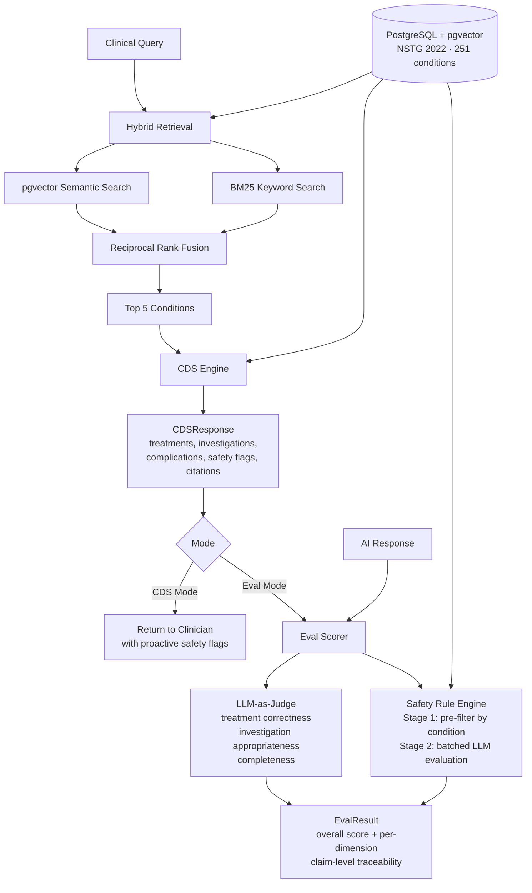

# ClinicalGuard

An open-source framework for evaluating clinical AI against treatment guidelines, built around a pluggable adapter pattern so any guideline can be plugged in. NSTG 2022 (251 conditions) is the first adapter.

## What it is

ClinicalGuard evaluates clinical AI systems against structured medical guidelines. It is designed to support any treatment guideline through a pluggable adapter pattern, with NSTG 2022 (251 conditions) as the first adapter dataset.

It operates in two modes:

- **CDS mode:** returns guideline-backed recommendations for clinical queries, with citations and proactive safety flags.
- **Eval mode:** scores AI-generated clinical responses against the guideline across safety adherence, treatment correctness, investigation appropriateness, and completeness.

## Why it exists

General clinical AI benchmarks like HealthBench evaluate whether a model has broad medical knowledge. ClinicalGuard evaluates something different: whether an AI response conforms to the specific guidelines a deploying organisation has chosen to follow.

A Nigerian hospital deploying a clinical AI agent needs to know whether that agent follows NSTG, not whether it can pass a US medical licensing exam. As frontier models saturate general medical knowledge, the unsaturated question is context conformance: does a model follow the rules of a specific setting, its national guideline, its formulary, its local protocols. ClinicalGuard is built for that question.

## What ClinicalGuard is not

ClinicalGuard evaluates guideline conformance. It does not evaluate clinical outcomes, longitudinal care decisions, or patient-specific factors that would override a guideline. Strong performance on a ClinicalGuard evaluation does not guarantee good patient outcomes. It means the AI responded in a way consistent with the specified guidelines.

## Architecture


```mermaid
graph TD
    A[Clinical Query] --> B[Hybrid Retrieval]
    B --> B1[pgvector Semantic Search]
    B --> B2[BM25 Keyword Search]
    B1 --> B3[Reciprocal Rank Fusion]
    B2 --> B3
    B3 --> C[Top 5 Conditions]

    C --> D[CDS Engine]
    D --> E[CDSResponse\ntreatments, investigations,\ncomplications, safety flags, citations]

    E --> F{Mode}

    F -->|CDS Mode| G[Return to Clinician\nwith proactive safety flags]

    F -->|Eval Mode| H[Eval Scorer]
    I[AI Response] --> H
    H --> H1[LLM-as-Judge\ntreatment correctness\ninvestigation appropriateness\ncompleteness]
    H --> H2[Safety Rule Engine\nStage 1: pre-filter by condition\nStage 2: batched LLM evaluation]
    H1 --> J[EvalResult\noverall score + per-dimension\nclaim-level traceability]
    H2 --> J

    K[(PostgreSQL + pgvector\nNSTG 2022 · 251 conditions)] --> B
    K --> D
    K --> H2
```

**Foundation:** PostgreSQL with pgvector. Each guideline dataset is ingested through a dataset-specific adapter that maps source data into a generic schema. Adding a new guideline requires only a new adapter. Every architectural decision is documented in `docs/adr/`.

**Retrieval:** Hybrid search combining pgvector semantic search and BM25 keyword matching, fused with Reciprocal Rank Fusion. HyDE (Hypothetical Document Embeddings) is available as an optional mode for constitutional symptom queries. In testing, HyDE moved Pulmonary Tuberculosis from rank 17 to rank 6 for the query "productive cough, night sweats, weight loss."

**Safety engine:** Two-stage evaluation. Stage 1 pre-filters rules by condition, narrowing the full rule set to the relevant subset. Stage 2 sends the relevant rules to an LLM in a single batched call. The rule description is the evaluation criterion, so adding a new rule requires no code changes. Safety detection uses a stronger judge model than the rubric scorer, chosen because weaker models reliably detect prohibited actions (commissions) but miss required-but-absent steps (omissions).

**Eval scorer:** Evaluates a response across four dimensions against physician-authored ground truth, with each rubric element tiered required, expected, or situational, and claims traced back to the NSTG source (classified supported, inferrable, unsupported, or contradicted). The scoring layer is under active development: the current focus is making scoring deterministic by decomposing rubric items into atomic, independently-checkable criteria and separating what an LLM judges (which elements a response addressed) from what code computes (the score). See `docs/methodology.md` for the evaluation design, and the ADRs for the decisions behind the redesign.

**API and frontend:** REST API and eval dashboard. Phase 3, planned.

## Current state

**Phase 1 (Foundation), complete:**

- PostgreSQL with pgvector, Alembic migrations
- 251 NSTG conditions ingested with findings, treatments, investigations, complications, differentials, prevention measures, and adverse reactions
- Hybrid retrieval pipeline with HyDE support

**Phase 2 (Intelligence), in progress:**

- CDS response structure with citations and safety flags
- Two-stage safety rule engine with verified NSTG-grounded rules, each rule sourced to a guideline reference
- Eval scorer across four dimensions with required/expected/situational tiering and claim-level traceability
- A growing set of physician-authored eval cases, authored and reviewed by clinicians through the authoring UI
- Scoring methodology under active redesign toward deterministic, atomic-criterion scoring (see Methodology and ADRs)

**Phase 3 (Benchmark), planned:**

Retrieval benchmarking, contextual scoring, regression-detection CI gates, and the eval dashboard.

## Methodology

Evaluation design, ground-truth construction, scoring approach, measured variance, and acknowledged limitations are documented in [docs/methodology.md](docs/methodology.md). The methodology is evolving as the scoring layer is redesigned; the ADRs in `docs/adr/` record each decision and the reasoning behind it.

## Getting started

```bash
git clone https://github.com/hemjay07/clinicalguard.git
cd clinicalguard
python3.11 -m venv .venv
source .venv/bin/activate
pip install -e ".[dev]"
```

Copy `.env.example` to `.env` and fill in your credentials:

```
DATABASE_URL=your_supabase_connection_string
OPENAI_API_KEY=your_openai_key
```

Run migrations, ingest the dataset, and seed safety rules:

```bash
alembic upgrade head
python -m clinicalguard.ingestion.run_ingestion
python -m clinicalguard.ingestion.run_embeddings
python -m clinicalguard.safety.seed_rules
```

Run tests:

```bash
pytest tests/ -v
```

## Contributing

See [CONTRIBUTING.md](CONTRIBUTING.md) for how to add a new guideline adapter, contribute safety rules, or make code contributions. Clinical contributors, physicians who can author or review eval cases, see the Clinical Contributors section of CONTRIBUTING.md.

## Dataset

Built on the Nigeria Clinical Guidelines Dataset, curated by [Chisom Rutherford](https://twitter.com/ruthefordml). Available on [HuggingFace](https://huggingface.co/datasets/chisomrutherford/nigeria-clinical-guidelines-dataset). Licensed under CC BY 4.0.
